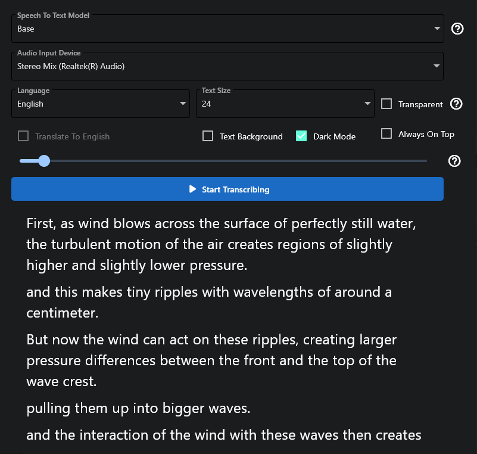

# Transcriber

A real-time speech to text transcription app built with Flet and OpenAI Whisper.



https://user-images.githubusercontent.com/69365652/205431746-1ece6d20-85a6-4112-ba5a-ee050b67268c.mp4

## Setting Up An Environment
On Windows:
```
cd transcriber_app
py -3.7 -m venv venv
venv\Scripts\activate
pip install -r requirements.txt
```
On Unix:
```
cd transcriber_app
python3.7 -m venv venv
source venv/bin/activate
pip intsall -r requirements.txt
```

## Running From Source
```
python transcriber.py
```

## Building From Source
```
python cx_freeze_setup.py build
```
This puts the output in the build directory.

## Usage
* Select an input source using the dropdown.
* Click "Start Transcribing"

Selecting a specific language will greatly improve the transcription results.

Transcriber can also be used to translate from other languages to English.

You can change the audio model to improve performance. On slow machines you might prefer the Tiny model.

You can also make the window transparent and set the text background, this is useful for overlaying on other apps. There's an invisible draggable zone just above and below the "Stop Transcribing" button, use this to move the window when it is transparent.

## Hidden Features
When you stop a transcription, the lines from the transcription will be saved to `transcription.txt` in the same file as the app.

Starting a transcription saves the current settings to `transcriber_settings.yaml`. These settings will be loaded automattically the next time you use the program.

In `transcriber_settings.yaml` you can additionally set:
* `transcribe_rate`
* `seconds_of_silence_between_lines`
* `max_record_time`

which have no onscreen controls.

`transcribe_rate` defines how often audio data shold be transcribed, in seconds. Decreasing this number will make the app more real time but will place more burden on your computer.

`seconds_of_silence_between_lines` defines how much silence (audio with volume lower than the volume threshold) is required to automatically break up the transcription into seperate lines.

`max_record_time` defines the maximum amount of time we should allow a recording to be transcribed. Longer transcriptions take longer to transcribe and may no longer be real time. If you have audio with no silence in it, consider reducing this to break up the audio in to smaller chunks.

## Q&A
Why do you use cx_Freeze instead of PyInstaller like Flet recommends?

* It looks like PyInstaller and PyTorch don't get along. I tried building with PyInstaller and got errors with missing torch packages. I spent a bit of time trying to get it to work before switching to cx_Freeze which worked almost immediately.

Read more about Whisper here: https://github.com/openai/whisper

Read more about Flet here: https://flet.dev/

The code in this repository is public domain.
